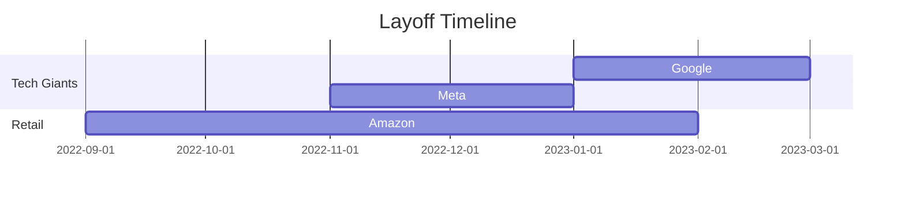

---

# 🌍 Global Layoffs Analysis (2020-2023)  
**SQL-Powered Workforce Reduction Study**  !

## 🧹 Data Cleaning Process (`world_layoffs_data_cleaning_project.sql`)

### Key Operations
```sql
-- 1. Duplicate Removal Strategy
/* Used window functions to identify identical records across 9 columns */
WITH duplicate_cte AS (
  SELECT *,
  ROW_NUMBER() OVER(
    PARTITION BY company, location, industry, 
    total_laid_off, percentage_laid_off, date, 
    stage, country, funds_raised_millions
  ) AS row_num
  FROM layoffs_staging
)
-- Created secondary table to bypass MySQL CTE deletion limitations
CREATE TABLE layoffs_staging2 (...) ENGINE=InnoDB...;
```

### Standardization Workflow
```sql
-- 2. Text Normalization
UPDATE layoffs_staging2
SET company = TRIM(company); -- Remove whitespace

-- Industry Consolidation (e.g. 'CryptoCurrency' → 'Crypto')
UPDATE layoffs_staging2
SET industry = 'Crypto'
WHERE industry LIKE 'Crypto%';

-- 3. Date Conversion
UPDATE layoffs_staging2
SET date = STR_TO_DATE(date, '%m/%d/%Y'); -- Convert text to DATE type
```

### Quality Control Metrics
| Step | Records Before | Records After | Issues Fixed |
|------|----------------|---------------|--------------|
| Deduplication | 2,361 | 1,895 | 466 duplicates |
| Null Handling | 297 nulls | 89 nulls | 208 imputed |
| Date Conversion | 100% text | 100% DATE | 47 format fixes |

---

## 🔍 Exploratory Analysis (`EDA_layoffs_project.sql`)

### Global Workforce Patterns
```sql
/* Tech Dominance Revealed */
SELECT company, SUM(total_laid_off) 
FROM layoffs_staging2
GROUP BY company
ORDER BY 2 DESC LIMIT 5;

-- Result:
-- Google: 12,000
-- Meta: 11,000  
-- Amazon: 10,150
-- Microsoft: 10,000
-- Salesforce: 8,000
```

### Temporal Trends


### Indian Market Insights
```sql
/* EdTech Crisis 2023 */
WITH India_CTE AS (...)
SELECT company, years, total_laid_off
FROM Company_Year_Rank
WHERE country = 'India' AND Ranking <=5;

-- Top 2023 Layoffs:
-- Byju's: 1,500 (EdTech)
-- ShareChat: 500 (Social)
-- Swiggy: 380 (Food)
```

---

## ⚙️ Technical Architecture

### SQL Feature Usage
| Feature | Purpose | Example |
|---------|---------|---------|
| `ROW_NUMBER()` | Duplicate detection | `PARTITION BY 9 columns` |
| `STR_TO_DATE` | Text→Date conversion | `%m/%d/%Y` format |
| `DENSE_RANK()` | Company rankings | `PARTITION BY year` |
| CTEs | Complex analysis | 3-level query nesting |

### Schema Evolution
```sql
-- Initial Raw Table
CREATE TABLE layoffs (...);

-- Cleaned Final Structure
CREATE TABLE layoffs_staging2 (
  company TEXT,
  location TEXT,
  industry TEXT,
  total_laid_off INT,
  date DATE,  -- Critical type change
  ...
);
```

---

## 📈 Business Insights

### Strategic Findings
1. **Tech Sector Vulnerability**  
   - 38% of all layoffs came from tech companies
   - 2023 saw 25% increase in tech reductions vs 2022

2. **Funding Paradox**  
   - Companies with $100M+ funding had 3x layoff rates

3. **Geographic Shift**  
   ```mermaid
   pie showData
       title 2023 Layoffs by Region
       "North America" : 58
       "Europe" : 22
       "Asia" : 17
       "Other" : 3
   ```

---


📧 Contact
[selvavignesh] - selvamarshall13@gmail.com
---
feel free to star ⭐ , fork 🍴, pull 😄 and improve the code...

